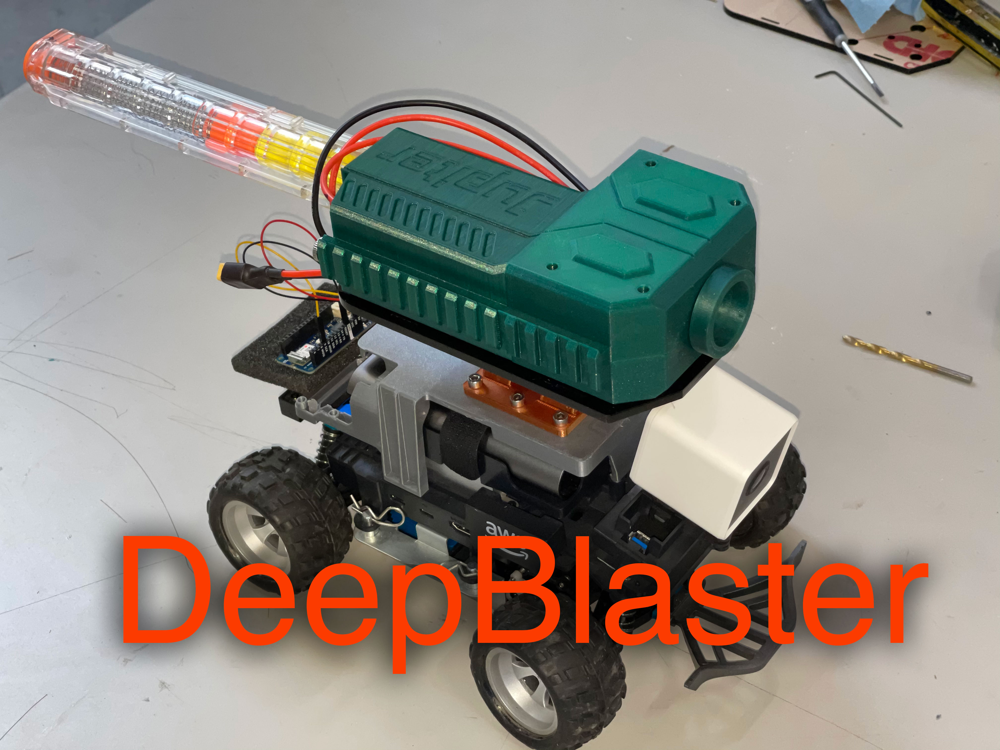

# Cloud Brigade DeepBlaster project

## Overview

The DeepBlaster project is an sample application built on top of the existing AWS DeepRacer application, and uses an object detection machine learning model through which the AWS DeepRacer device can identify and target an object. For detailed information on DeepBlaster project, see DeepBlaster project [Getting Started](https://github.com/CloudBrigade/cloudbrigade-deepblaster/blob/main/getting-started.md) section.

Read more about the story behind the project and the details of the design and development process on the [DeepBlaster Webpage](https://www.cloudbrigade.com/deepblaster/)

## License

The source code is released under [Apache 2.0](https://www.apache.org/licenses/LICENSE-2.0).

## Installation

### Prerequisites

The AWS DeepRacer device comes with all the pre-requisite packages and libraries installed to run the DeepBlaster project. More details about pre installed set of packages and libraries on the DeepRacer, and installing required build systems can be found in the [Getting Started](https://github.com/awsdeepracer/aws-deepracer-launcher/blob/main/getting-started.md) section of the AWS DeepRacer Opensource page. The DeepBlaster project requires the AWS DeepRacer application to be installed on the device as it leverages most of the packages from the core application.

The following are the additional software and hardware requirements to get the DeepBlaster project to work on the AWS DeepRacer device.

1. **Hardware:** You will need to obtain or design and build the turret and blaster. At the time of this writing, the turret and bracket exist as a prototype with improvements pending. You can read more about the necessary project hardware components in the [Getting Started](https://github.com/CloudBrigade/cloudbrigade-deepblaster/blob/main/getting-started.md) section.

1. **Download and Optimize the object detection model:** Follow the [instructions](https://github.com/CloudBrigade/cloudbrigade-deepblaster/blob/main/download-and-convert-object-detection-model.md) to download and optimize the object detection model and copy it to the required location on the AWS DeepRacer device.

1. **Calibrate the AWS DeepRacer (optional):** Follow the [instructions](https://docs.aws.amazon.com/deepracer/latest/developerguide/deepracer-calibrate-vehicle.html) to calibrate the mechanics of your AWS DeepRacer Vehicle. This should be done so that the vehicle performance is optimal and it behaves as expected.

1. **Setup Intel Neural Compute Stick 2 (optional):** The object_detection_node provides functionality to offload the inference to a Intel Neural Compute Stick 2 connected to the AWS DeepRacer device. This is an optional setting that is provided to enhance the inference performance of the object detection model. More details about running Inference on the Movidius NCS (Neural Compute Stick) with OpenVINO™ toolkit can be found here: https://www.youtube.com/watch?v=XPvMrGobe7I

    Attach the Neural Compute Stick 2 firmly in the back slot of the AWS DeepRacer, and open up a terminal and run the following commands as root user to install the dependencies of the Intel Neural Compute Stick 2 on the AWS DeepRacer device:

    1. Switch to root user:

            sudo su

    1. Navigate to the OpenVino installation directory:

            cd /opt/intel/openvino_2021/install_dependencies

    1. Set the environment variables required to run Intel OpenVino scripts:

            source /opt/intel/openvino_2021/bin/setupvars.sh

    1. Run the dependency installation script for Intel Neural Compute Stick:

            ./install_NCS_udev_rules.sh

## Downloading and Building

Open up a terminal on the DeepRacer device and run the following commands as root user.

1. Switch to root user before you source the ROS2 installation:

        sudo su

1. Stop the deepracer-core.service that is currently running on the device:

        systemctl stop deepracer-core

1. Source the ROS2 Foxy setup bash script:

        source /opt/ros/foxy/setup.bash

1. Set the environment variables required to run Intel OpenVino scripts:

        source /opt/intel/openvino_2021/bin/setupvars.sh

1. Create a workspace directory for the package:

        mkdir -p ~/deepracer_ws
        cd ~/deepracer_ws

1. Clone the entire DeepBlaster project on the DeepRacer device.

        git clone https://github.com/CloudBrigade/cloudbrigade-deepblaster.git
        cd ~/deepracer_ws/cloudbrigade-deepblaster/deepblaster_ws/

1. Clone the async_web_server_cpp, web_video_server and rplidar_ros dependency packages on the DeepRacer device:

        cd ~/deepracer_ws/cloudbrigade-deepblaster/deepblaster_ws/ && ./install_dependencies.sh

1. Fetch unreleased dependencies:

        cd ~/deepracer_ws/cloudbrigade-deepblaster/deepblaster_ws/
        rosws update

1. Resolve the dependencies:

        cd ~/deepracer_ws/cloudbrigade-deepblaster/deepblaster_ws/ && rosdep install -i --from-path . --rosdistro foxy -y

1. Build the packages in the workspace

        cd ~/deepracer_ws/cloudbrigade-deepblaster/deepblaster_ws/ && colcon build

## Usage

### Run the node

To launch the DeepBlaster sample application as root user on the AWS DeepRacer device open up another terminal on the device and run the following commands as root user:

1. Switch to root user before you source the ROS2 installation:

        sudo su

1. Source the ROS2 Foxy setup bash script:

        source /opt/ros/foxy/setup.bash

1. Set the environment variables required to run Intel OpenVino scripts:

        source /opt/intel/openvino_2021/bin/setupvars.sh

1. Source the setup script for the installed packages:

        source ~/deepracer_ws/cloudbrigade-deepblaster/deepblaster_ws/install/setup.bash

1. Launch the nodes required for DeepBlaster project:

        ros2 launch deepblaster_launcher deepblaster_launcher.py

### Enabling “deepblaster” mode using CLI:

Once the deepblaster_launcher has been kicked-off, open up a adjacent new terminal as root user:

1. Switch to root user before you source the ROS2 installation:

        sudo su

1. Navigate to the DeepBlaster workspace:

        cd ~/deepracer_ws/cloudbrigade-deepblaster/deepblaster_ws/

1. Source the ROS2 Foxy setup bash script:

        source /opt/ros/foxy/setup.bash

1. Source the setup script for the installed packages:

        source ~/deepracer_ws/cloudbrigade-deepblaster/deepblaster_ws/install/setup.bash

1. Enable “deepblaster” mode using the below ros2 service call

        ros2 service call /deepblaster_ctrl_pkg/enable_state deepracer_interfaces_pkg/srv/ArmBlasterSrv "{is_active: True}"

## Launch Files

The deepblaster_launcher.py included in this package is the main launcher file that launches all the required nodes for the DeepBlaster project. This launcher file also includes the nodes from the AWS DeepRacer core application.

from launch import LaunchDescription
from launch_ros.actions import Node

      def generate_launch_description():
          ld = LaunchDescription()
          deepblaster_object_detection_node = Node(
              package='deepblaster_object_detection_pkg',
              namespace='deepblaster_object_detection_pkg',
              executable='deepblaster_object_detection_node',
              name='deepblaster_object_detection_node',
              parameters=[{
                  'DEVICE': 'MYRIAD',
                  'PUBLISH_DISPLAY_OUTPUT': True
              }]
              )
          deepblaster_targeting_node = Node(
              package='deepblaster_targeting_pkg',
              namespace='deepblaster_targeting_pkg',
              executable='deepblaster_targeting_node',
              name='deepblaster_targeting_node'
              )
          deepblaster_ctrl_node = Node(
              package='deepblaster_ctrl_pkg',
              namespace='deepblaster_ctrl_pkg',
              executable='deepblaster_ctrl_node',
              name='deepblaster_ctrl_node'
              )
          camera_node = Node(
              package='camera_pkg',
              namespace='camera_pkg',
              executable='camera_node',
              name='camera_node'
          )
          ctrl_node = Node(
              package='ctrl_pkg',
              namespace='ctrl_pkg',
              executable='ctrl_node',
              name='ctrl_node'
          )
          deepracer_navigation_node = Node(
              package='deepracer_navigation_pkg',
              namespace='deepracer_navigation_pkg',
              executable='deepracer_navigation_node',
              name='deepracer_navigation_node'
          )
          software_update_node = Node(
              package='deepracer_systems_pkg',
              namespace='deepracer_systems_pkg',
              executable='software_update_node',
              name='software_update_node'
          )
          model_loader_node = Node(
              package='deepracer_systems_pkg',
              namespace='deepracer_systems_pkg',
              executable='model_loader_node',
              name='model_loader_node'
          )
          otg_control_node = Node(
              package='deepracer_systems_pkg',
              namespace='deepracer_systems_pkg',
              executable='otg_control_node',
              name='otg_control_node'
          )
          network_monitor_node = Node(
              package='deepracer_systems_pkg',
              namespace='deepracer_systems_pkg',
              executable='network_monitor_node',
              name='network_monitor_node'
          )
          device_info_node = Node(
              package='device_info_pkg',
              namespace='device_info_pkg',
              executable='device_info_node',
              name='device_info_node'
          )
          battery_node = Node(
              package='i2c_pkg',
              namespace='i2c_pkg',
              executable='battery_node',
              name='battery_node'
          )
          inference_node = Node(
              package='inference_pkg',
              namespace='inference_pkg',
              executable='inference_node',
              name='inference_node'
          )
          model_optimizer_node = Node(
              package='model_optimizer_pkg',
              namespace='model_optimizer_pkg',
              executable='model_optimizer_node',
              name='model_optimizer_node'
          )
          rplidar_node = Node(
              package='rplidar_ros',
              namespace='rplidar_ros',
              executable='rplidarNode',
              name='rplidarNode',
              parameters=[{
                      'serial_port': '/dev/ttyUSB0',
                      'serial_baudrate': 115200,
                      'frame_id': 'laser',
                      'inverted': False,
                      'angle_compensate': True,
                  }]
          )
          sensor_fusion_node = Node(
              package='sensor_fusion_pkg',
              namespace='sensor_fusion_pkg',
              executable='sensor_fusion_node',
              name='sensor_fusion_node'
          )
          servo_node = Node(
              package='servo_pkg',
              namespace='servo_pkg',
              executable='servo_node',
              name='servo_node'
          )
          status_led_node = Node(
              package='status_led_pkg',
              namespace='status_led_pkg',
              executable='status_led_node',
              name='status_led_node'
          )
          usb_monitor_node = Node(
              package='usb_monitor_pkg',
              namespace='usb_monitor_pkg',
              executable='usb_monitor_node',
              name='usb_monitor_node'
          )
          webserver_publisher_node = Node(
              package='webserver_pkg',
              namespace='webserver_pkg',
              executable='webserver_publisher_node',
              name='webserver_publisher_node'
          )
          web_video_server_node = Node(
              package='web_video_server',
              namespace='web_video_server',
              executable='web_video_server',
              name='web_video_server'
          )
          ld.add_action(deepblaster_object_detection_node)
          ld.add_action(deepblaster_targeting_node)
          ld.add_action(deepblaster_ctrl_node)
          ld.add_action(camera_node)
          ld.add_action(ctrl_node)
          ld.add_action(deepracer_navigation_node)
          ld.add_action(software_update_node)
          ld.add_action(model_loader_node)
          ld.add_action(otg_control_node)
          ld.add_action(network_monitor_node)
          ld.add_action(device_info_node)
          ld.add_action(battery_node)
          ld.add_action(inference_node)
          ld.add_action(model_optimizer_node)
          #ld.add_action(rplidar_node)
          ld.add_action(sensor_fusion_node)
          ld.add_action(servo_node)
          ld.add_action(status_led_node)
          ld.add_action(usb_monitor_node)
          ld.add_action(webserver_publisher_node)
          ld.add_action(web_video_server_node)
          return ld

### Configuration File and Parameters

Applies to the object_detection_node

| Parameter Name   | Description  |
| ---------------- |  ----------- |
| DEVICE (optional) | If set as MYRIAD, will use the Intel Compute Stick 2 for inference. Else uses CPU for inference by default, even if removed. |
| PUBLISH_DISPLAY_OUTPUT | Set to True/False if the inference output images need to be published to localhost using web_video_server|

## Resources

* Cloud Brigade DeepBlaster project webpage [https://www.cloudbrigade.com/deepblaster/](https://www.cloudbrigade.com/deepblaster/)
* AWS DeepRacer Opensource getting started: [https://github.com/awsdeepracer/aws-deepracer-launcher/blob/main/getting-started.md](https://github.com/awsdeepracer/aws-deepracer-launcher/blob/main/getting-started.md)
* Cloud Brigade DeepBlaster project getting started: [https://github.com/CloudBrigade/cloudbrigade-deepblaster/blob/main/getting-started.md](https://github.com/CloudBrigade/cloudbrigade-deepblaster/blob/main/getting-started.md)
* Instructions to download and optimize the object detection model: [https://github.com/CloudBrigade/cloudbrigade-deepblaster/blob/main/download-and-convert-object-detection-model.md](https://github.com/CloudBrigade/cloudbrigade-deepblaster/blob/main/download-and-convert-object-detection-model.md)
* Instructions to calibrate your AWS DeepRacer: [https://docs.aws.amazon.com/deepracer/latest/developerguide/deepracer-calibrate-vehicle.html](https://docs.aws.amazon.com/deepracer/latest/developerguide/deepracer-calibrate-vehicle.html)
