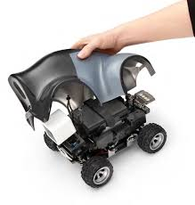

# DeepBlaster Sample Application

The DeepBlaster project is a sample application built on top of the existing AWS DeepRacer application which uses object detection machine learning model through which the Cloud Brigade DeepBlaster device can identify and target an object. Explore the DeepBlaster project by cloning the [cloudbrigade-deepblaster](https://github.com/CloudBrigade/cloudbrigade-deepblaster).

The DeepBlaster application uses many nodes from the AWS DeepRacer core application as is and adds a few specific extension to the shared nodes. This application is built to work alongside the AWS DeppRacer core application so that we can run both of the applications simultaneously.

* **DeepRacer Core Packages used without modification**
    * camera_pkg
    * deepracer_navigation_pkg
    * deepracer_systems_pkg
    * device_info_pkg
    * i2c_pkg
    * inference_pkg
    * model_optimizer_pkg
    * sensor_fusion_pkg
    * servo_pkg
    * status_led_pkg
    * usb_monitor_pkg
    * webserver_pkg
    * ctrl_pkg
    * deepracer_interfaces_pkg
* **DeepBlaster functionality specific packages**
    * deepblaster_ctrl_pkg
    * deepblaster_interfaces_pkg
    * deepblaster_targeting_pkg
    * deepblaster_object_detection_pkg

## Hardware Setup

The DeepBlaster project is built to work on **AWS Deepracer** with a single camera attached to it. Additional parts are required to modify your AWS DeepRacer car to become a DeepBlaster as follows :

* **Required**
* 3d printed base bracket (based on the Lidar bracket design)
* 3d printed turret bracket, gear, and flange
* Nerf style "blaster"
* 2 30A Mosfet boards
* Arduino Nano Every board or similar (see hardware requirements for Servo library)
* RC servo
* Misc cabling and mounting hardware

* **Recommended**
* [Upgraded adjustable shocks] (https://www.amazon.com/Hobbypark-Aluminum-Absorber-Assembled-Replacement/dp/B019XU3C3O)
* Intel Neural Compute Stick

* **Optional**
* Second DeepRacer camera

You can also connect an **Intel Neural Compute Stick 2** to the USB slot at the rear end of the car as depicted to improve the inference performance.

**Building the Jupiter Blaster**

If you choose to purchase a Jupiter Blaster from Out Of Darts, instructions for building the blaster [including a video](https://www.youtube.com/watch?v=OQmhm2NQptM) are provided.

We recommend excluding the blaster handle in your build as it is unnecessary and adds weight to the build.

PLEASE NOTE: The wiring diagram for the DeepBlaster is different than what is provided by Out Of Darts. We exclude the microswitches provided, and instead use Mosfets to switch the loads from the Arduino. The wiring diagram is substantially different because the Mosfets switch both the positive and negative sides of the circuit. Please follow the DeepBlaster wiring diagram below.

**Wiring Diagram for Electronics**

Below is the complete wiring diagram for the DeepBlaster Blaster Control Module (Arduino), X-axis Servo motor, and Jupiter Blaster with Mosfets.

This prototype was built using the Arduino MKR 1010 which includes unused components such as wifi and bluetooth. We recommend the Arduino Nano Every due to lower size and cost.

PLEASE NOTE: The Arduino MKR series and the Arduino Nano Every series of microcontrollers use different pin locations. If you use an Arduino Nano Every, you will need to modify the wiring diagram, as well as the pin definitions in the code if they are changed.

WARNING: The Jupiter Blaster Flywheels must be spinning prior to feeding ammo with the feeder motor. Failure to observe this warning will result in damage to the Mosfet, motor, wiring, etc. It is recommended that you do not load ammo into your DeepBlaster until you have confirmed proper operation after assembly.

WARNING: Inserting the Nerf Magazine will deploy a single ammo ball into the feeder motor (even without power). This will result in a possible jam of the flywheels unexpectedly. You can clear the ammo using a ball point pin, pencil, screwdriver, etc. Don't use your fingers...

**Installing the DeepBlaster Hardware on AWS DeepRacer**

You can install the DeepBlaster hardware by following these steps.

1. Remove the shell and shell mounts

2. Mount the DeepBlaster turret and bracket assembly

3. Attach the DeepBlaster blaster mounting plate

4. Attach the Jupiter Blaster and Mosfets

5. Mount DeepBlaster Control Module (Arduino)
6. Attach cables and affix to cable routing tabs

**Building the DeepBlaster Software on AWS DeepRacer**

Please see the project [README.md](https://github.com/CloudBrigade/cloudbrigade-deepblaster/blob/main/README.md) for instructions on how to build the software.

## Software Main Components

There are 5 packages (ROS Nodes) that are of importance for the DeepBlaster project.

1. [Object Detection Package](https://github.com/CloudBrigade/cloudbrigade-deepblaster/tree/main/deepblaster_ws/object_detection_pkg) - Package responsible to detect object (bottle) from the camera sensor images and calculate the error (delta) in displacement of the object from ideal position to be provided to the deepblaster_targeting_pkg.

1. [DeepBlaster Targeting Package](https://github.com/CloudBrigade/cloudbrigade-deepblaster/tree/main/deepblaster_ws/deepblaster_targeting_pkg) - Package responsible for collecting the delta results from object detection and mapping it to the Blaster Control message with turret servo angle values, flywheel, and trigger values.

1. [DeepBlaster Launcher Package](https://github.com/CloudBrigade/cloudbrigade-deepblaster/tree/main/deepblaster_ws/deepblaster_launcher) - The DeepBlaster Interfaces ROS package is a foundational package that creates the custom service and message types that are used in the Cloud Brigade DeepBlaster application, but has been modified to support DeepBlaster project.

1. [DeepBlaster Control Package](https://github.com/CloudBrigade/cloudbrigade-deepblaster/tree/main/deepblaster_ws/deepblaster_ctrl_pkg) - Package  responsible for creating Blaster Control node with services exposed to be used by webserver backend API calls. This manages the external Blaster Control Module (Arduino), aims the Blaster at the detected object, spins up the Blaster flywheels, and feeds ammo.

1. [DeepBlaster Interfaces Package](https://github.com/CloudBrigade/cloudbrigade-deepblaster/tree/main/deepblaster_ws/deepracer_interfaces_pkg) - The DeepRacer Interfaces ROS package is a foundational package that creates the custom service and message types that are used in the DeepBlaster project.

## DeepBlaster Armed Function:

The DeepBlaster project introduces a new function in the AWS Deepracer device, and is intended to be used with the existing modes of operation(autonomous mode or manual mode). More details about the existing modes of operation in the AWS Deepracer device is found [here](https://github.com/awsdeepracer/aws-deepracer-launcher/blob/main/modes-of-operation.md).

When the DeepBlaster is armed, the DeepRacer devices takes the camera image input from the front facing camera connected to the car and runs it through the machine learning model to identify an object ("bottle" by default) and calculate information required to aim the turret toward the object. Similar to the autonomous mode, there is an perception-inference-action step involved here as well, where the inference is done by an object detection model to obtain the bounding box data for a object identified in the image. Each perception-inference-action step involves a pipeline of a series of ROS messages published/subscribed at various nodes, to publish camera image, and then to publish the object detection deltas identifying person’s position and corresponding action data to follow the person.

### Inference (Decision)

The inference step is handled by the Object Detection ROS package that creates the object_detection_node responsible for collecting sensor data (camera images) from sensor_fusion_pkg and running object detection on specified object. A target center is specified in the object_detection_node that acts as reference to calculate the detection error (delta) whenever an object is detected. As part of this step, the node publishes the normalized delta data from target point as DetectionDeltaMsg data identifying the object’s position.

For each input image, the node will detect object and get coordinates of center of bounding box and calculate the (x, y) delta of the [current position of detected object - target position] is calculated as shown in the figure below:

This delta value is published as the DetectionDeltaMsg data to /deepblaster_object_detection_pkg/object_detection_delta topic which will be read by the DeepBlaster targeting node. If no object is detected in a image, the object_detection_node publishes a zero error (delta) signifying that the DeepBlaster take no action and need not move.

### Action (Targeting)

The DeepBlaster Targeting ROS package creates the deepblaster_targeting_node which decides the action / controller message to send out based on the normalized detection error (delta) received from deepblaster_object_detection_node. The node uses a very simple action space to account for the various combinations of the (x, y) delta values that are expected.

**Static Action Space:**

As of this version, the DeepBlaster uses a simple "static" action space to aim the turret using object detection data from the onboard DeepRacer camera. Because the onboard camera is in a fixed position, the turret will be pointed in the nearest action space location to the object detection delta {delta_x}.

**Dynamic Action Space:**

A future version of DeepBlaster will provide for a second turret mounted camera which will allow for a more accurate "dynamic" action space, allowing for continual adjustment of the turret angle until the object detection delta {delta_x} is zero. Additionally a second servo to adjust turret height can be added, and tied to the object detection delta {delta_y}

Based on the above diagram, we can see that there are 5 different cases to handle with respect to the {delta_x} values. These {delta_x} values define the difference in the target position to the center of the bounding box in the current image that was run through object detection. We have defined the following simple action space to handle these 5 cases:

|   Case    |     Turret     |
| --------- | -------------- |
|     1     |    Center      |
|     2     |    Left        |
|     3     |    Far Left    |
|     4     |    Right       |
|     5     |    Far Right   |

It is important to map specific thresholds for the {delta_x} values to the actions defined above in order to ensure a safe and meaningful selection of actions, and to minimize servo jerkiness. These actual delta values to trigger each of the action from the above action space was defined by empirically collecting the {delta_x} value of the object (object detected in front of camera) at different positions with respect to the camera of the DeepRacer device. The grid diagram below shows a top down view of the placement positions with the car with camera placed at the bottom.

The average of the changes in x and y (delta_x and delta_y) for over 3 x 20 incidents for each position is shared below. These {delta_x, delta_y} values with respect to the object (person) position from the camera enables us to create a safe distance bracket for valid actions. These brackets are then mapped to the steering and the speed values required by the DeepRacer servo node.

Based on the data collected, we get the following brackets:

**Targeting:**

* DEFAULT: No movement, when the object is positioned on the straight line of sight with respect to camera
* SHORT_LEFT: With respect to 15 cm Left
* FAR_LEFT: With respect to 45 cm Left
* SHORT_RIGHT: With respect to 15 cm Right
* FAR_RIGHT: With respect to 45 cm Right
* FIRE: Object detected, when the object is positioned on the straight line of sight with respect to camera

**Firing:**

* DEFAULT: Motors Off
* FLYWHEEL: Object detected
* TRIGGER: Turret servo moved into position

For every combination of the normalized delta combination in x (delta_x), based on the above brackets of actions for aiming and firing, an action is planned by the deepblaster_targeting_node and published to be picked up by the deepblaster_ctrl_node when the node has been armed.

Hence, using this pipeline for Perception - Inference - Action on a loop, the DeepRacer detects an object, plans what action is needed to bring the turret to the target position and takes the action for each image it infers on, thus achieving the goal of blasting the target.

## Project Status

At the time of this writing, Cloud Brigade DeepBlaster is a prototype. Several lessons were learned, and additional improvements to both hardware and software are planned.

1. The 3d printed parts require redesign to conserve space, lower the center of gravity, reduce weight, and accommodate a larger servo motor (we already broke one mini servo).

1. The project is intended to use a turret mounted camera and a dynamic action space, allowing the turret to make continual targeting adjustments and with better accuracy. This will also allow 360 aiming of the turret, as opposed to the limited static action space due to the narrow field of view from the DeepRacer camera.

1. The current blaster adds a lot of weight due to the rugged construction needed for hand held "battle". A modified blaster could reduce weight and size, while still using the original flywheel design and components.  

## Possible next steps:

This project can be used as a guide to think about more interesting applications by modifying/enhancing the logic and action space used in the deepblaster_targeting_node as well as using the following capability to build more applications. This project has been designed to give more independence on modifying or adding your own logic and ideas without having to rework everything from scratch.

In particular the AWS DeepRacer lacks additional ports to control servos and other electronics. The DeepBlaster Controller python and Arduino code provides a [robust serial control protocol](https://github.com/araffin/arduino-robust-serial) as well as [Servo Trajectory Controller](https://github.com/chillibasket/arduino-classes/tree/master/servo-trajectory) providing the capability to adjust servo speed rapidly while providing for smooth acceleration and deceleration, intended to minimize motion induced blur in the turret mounted camera. Additional logic is provided to control motors. Conceivably you could add sensors to the Arduino and send communication back to the Blaster Control Node, and publish those messages to other nodes.

## Competitive Games

One inspiration for this project was the possibility of extending the DeepRacer Racing League with an offshoot. In this case cars would compete to complete a track in the shortest period of time, however the total score would be calculated by the number of objects successfully neutralized along the way.

## Battlebots AI Edition

If you loved Battlebots, this opens the door to autonomous robot battles. What could possibly go wrong?

## Summary

The DeepBlaster project leverages most of the concepts used in the AWS DeepRacer application, and adds a few more. You can learn more about the AWS DeepRacer core application [here](https://github.com/awsdeepracer/aws-deepracer-launcher/blob/main/getting-started.md).

Read more about the story behind the project and the details of the design and development process on the [DeepBlaster Webpage](https://www.cloudbrigade.com/deepblaster/)

If you're wondering who made this crazy contraption, you can find him at his consulting company [Cloud Brigade](https://www.cloudbrigade.com), on [LinkedIn](https://www.linkedin.com/in/chris-miller-6470751/), or you can email Chris at [ctodd@cloudbrigade.com](ctodd@cloudbrigade.com  )

## Resources

* Cloud Brigade DeepBlaster project webpage [https://www.cloudbrigade.com/deepblaster/](https://www.cloudbrigade.com/deepblaster/)
* Cloud Brigade DeepBlaster Opensource getting started: [https://github.com/awsdeepracer/aws-deepracer-launcher/blob/main/getting-started.md](https://github.com/awsdeepracer/aws-deepracer-launcher/blob/main/getting-started.md)
* Cloud Brigade DeepBlaster device modes of operation: [https://github.com/awsdeepracer/aws-deepracer-launcher/blob/main/modes-of-operation.md](https://github.com/awsdeepracer/aws-deepracer-launcher/blob/main/modes-of-operation.md).
